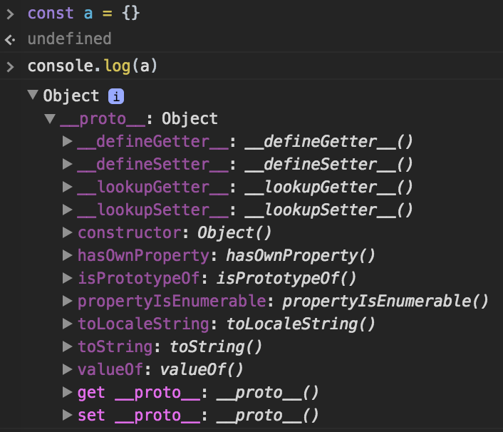

วันนี้มาลองเขียนบทความให้สมชื่อ CodeSheep หรือแกะโค้ดกันนะครับ เป็นแนวบทความที่อยากลองนำโค้ดที่อยู่ในโปรเจค Open Source ดังๆ มาแกะดูว่าเค้าใช้เทคนิกอะไรในการเขียนกันบ้าง โดยจะพยายามแยกแต่ละเรื่องในโค้ดเป็น 1 ตอนถ้าสามารถแยกได้นะครับ

Project: React Router v4 alt branch
-----------------------------------
โปรเจคที่เรามาแกะกันคือ React Router ถ้าใครใช้ React คงจะรู้จักกันดี แต่ถ้าใครไม่รู้จักก็ไม่เป็นไรครับ เพราะโค้ดส่วนที่จะแกะเป็นความรู้ทั่วไปใช้กับโปรเจคไหนก็ได้ ณ วันที่เขียนอยู่นี้รุ่น stable ยังเป็น v3 ส่วน v4 ยังเป็น alpha อยู่ นอกจากนั้น v4 ยังมี branch คู่ขนานชื่อ `v4-alt` ซึ่งเป็นการ rewrite v4 ขึ้นมาอีกรอบโดยยังไม่สรุปว่าสุดท้ายแล้วจะใช้ branch ไหน แต่ในโค้ดตัวอย่างที่เราจะแกะวันนี้จะใช้ branch `v4-alt` กันครับ


โดยโค้ดเราจะอ้างอิงจาก [commit นี้]( https://github.com/ReactTraining/react-router/tree/f828a0c21f82309bebc55bdd438faaae078cbaf9) ซึ่งเป็น commit ล่าสุด ณ วันที่เขียนบทความนี้

matchPattern.js
---------------
ไฟล์ที่เราจะมาแกะกันคือไฟล์ `modules/matchPattern.js` ซึ่งมีหน้าที่ในการทดสอบว่า URL ที่ router ได้รับนั้นตรงกับ pattern ที่ระบุไว้หรือไม่

pattern หน้าตาเป็นแนวแบบนี้ครับ
- `/` จะ match กับ root domain
- `/users` จะ match `/users`
- `/users/:userId` จะ match URL param เช่น `/users/1`, `/users/4` เป็นต้น

โดยเราสามารถระบุค่า exact ว่าต้อง match แบบเป๊ะๆหรือไม่นะครับ เช่น pattern `/` ถ้าเราระบุ exact นั้นตัว URL จะต้องเป็น `/` เท่านั้น

แต่ถ้าเราไม่ต้องการแบบ exact แล้วถ้า URL เป็น `/users` ก็จะถือว่า match กับ pattern '/' เหมือนกันครับ เพราะมี `/` อยู่ใน URL

ขอพูดคร่าวๆแค่นี้ ไม่งั้นเดี๋ยวจะกลายเป็นบทความสอนใช้ React Router v4 ไป เอาเป็นว่าลองมาดูโค้ดเต็มๆของไฟล์นี้กันเลยดีกว่าครับ ไฟล์เล็กๆน่ารัก 41 บรรทัด แต่มีจุดที่น่าสนใจหลายที่ (ยังไม่ต้องสนใจโค้ดก็ได้ครับ แค่ยกมาให้ดูหน้าตาคร่าวๆของมันเฉยๆ)

[`/modules/matchPattern.js`](https://github.com/ReactTraining/react-router/blob/f828a0c21f82309bebc55bdd438faaae078cbaf9/modules/matchPattern.js)

``` js
import pathToRegexp from 'path-to-regexp'

const patternCache = Object.create(null)

const compilePattern = (pattern) => {
  if (!patternCache[pattern]) {
    const keys = []
    const re = pathToRegexp(pattern, keys)
    patternCache[pattern] = { re, keys }
  }

  return patternCache[pattern]
}

const matchPattern = (pattern, exact, pathname) => {
  if (!pattern)
    return { pathname, isExact: true, params: {} }

  const { re, keys } = compilePattern(pattern)
  const match = re.exec(pathname)

  if (!match)
    return null

  const [ path, ...values ] = match
  const isExact = pathname === path

  if (exact && !isExact)
    return null

  return {
    isExact,
    pathname: path,
    params: keys.reduce((memo, key, index) => {
      memo[key.name] = values[index]
      return memo
    }, {})
  }
}

export default matchPattern
```

ในตอนนี้เราจะมาดูที่บรรทัดที่ 3 กันครับ

``` js
const patternCache = Object.create(null)
```
ซึ่งตามชื่อเลยคือเป็น cache ของ pattern ถ้ามี pattern นี้อยู่ใน cache แล้วก็ไม่ต้อง process ซ้ำ ตอบกลับจากค่าใน cache ได้ทันที ลองดูตัวอย่างที่เค้าใช้ในฟังก์ชัน `compilePattern` ก็ได้ครับ

คำถามคือ ทำไมต้องใช้ `const patternCache = Object.create(null)` ทำไมไม่ใช้ `const patternCache = {}` ซึ่งเป็น JavaScript Object ที่ไว้เก็บ key, value ได้เหมือนกัน? ซึ่งเป็นเนื้อหาหลักของ blog ตอนนี้ครับ

const patternCache = Object.create(null)
----------------------------------------
ฟังก์ชัน `Object.create` ใช้ในการสร้าง JavaScript object ใหม่ขึ้น โดยสามารถระบุได้ว่าจะให้ inherit property มาจาก prototype ตัวไหน (prototype คล้ายๆกับ instance ใน OOP)

ลองดูตัวอย่างนี้
```js
const a = { val: 10, chrArr: ['x', 'y'] }
const b = Object.create(a)
console.log(b.val) // 10
console.log(b.chrArr) // ['x', 'y']
```
จะเห็นว่า `b` ได้ property ทั้งหมดของ `a` มาด้วย โดย property ไหนเป็น reference เราก็จะได้ reference ที่ชี้ไปที่เดียวกัน เช่น `charArr` เป็น reference ก็จะชี้ไปที่ `charArr` ที่ `a` ได้สร้างเอาไว้

ลองทดสอบดูนะจะได้ตามตัวอย่างนี้
```js
console.log(b.chrArr === a.chrArr) // true
b.chrArr[0] = 'z' // เปลี่ยนค่าใน array ที่เป็น reference
console.log(b.chrArr) // ['z', 'y']
console.log(a.chrArr) // ['z', 'y'] ค่าที่ a เปลี่ยนด้วยเพราะชี้ไปที่เดียวกัน
```

ดังนั้นการที่เราสั่ง `Object.create(null)` ขึ้นมา โดย inherit property จาก null ซึ่งก็คือไม่มี property ใดๆ ทำให้ได้ JavaScript Object เปล่าๆขึ้นมานั่นเอง
```js
const a = Object.create(null)
console.log(a) // ได้ Object {} และไม่มี property ใดๆ
```
ซึ่งก็เลยนำมาใช้เป็น cache แบบ key-value ที่ไม่มี key ใดๆเป็นค่าเริ่มต้น

const patternCache = {}
-----------------------
คราวนี้มาดูกันว่า `Object.create(null)` มันต่างกับ `{}` ยังไง ลองดูจากผลลัพธ์ของโค้ดนี้กันนะครับ



จะเห็นว่าการสร้าง `const a = {}` จะทำให้ `a` ได้ inherit property ของ `Object.prototype` มาด้วย (ลองทดสอบกันเองด้วย `console.log(Object.prototype)` ดูนะครับ)

ดังนั้นจริงๆ แล้ว `const a = {}` นั้นมีค่าเท่ากับ `const a = Object.create(Object.prototype)` นั่นเอง

สรุป
---
ดังนั้นเหตุผลที่เค้าไม่ใช้ `const patternCache = {}` แต่เลือกใช้ `const patternCache = Object.create(null)` ก็เพราะว่าเค้าต้องการ cache ที่ไม่มี key ใดๆติดมานั่นเอง (ถ้าสร้างด้วย `const patternCache = {}` แล้วสั่ง `if (patternCache['toString'])` จะได้ค่าเป็น `true` แม้ว่าจะไม่เคย cache ค่านี้มาก่อน)

เดี๋ยวในตอนต่อไปจะมาแกะโค้ดไฟล์นี้กันต่อนะครับ

และสุดท้ายนี้ก็ขอสวัสดีปีใหม่ชาวโปรแกรมเมอร์ไทยทุกคนนะครับ

Happy New Year 2017 :)
