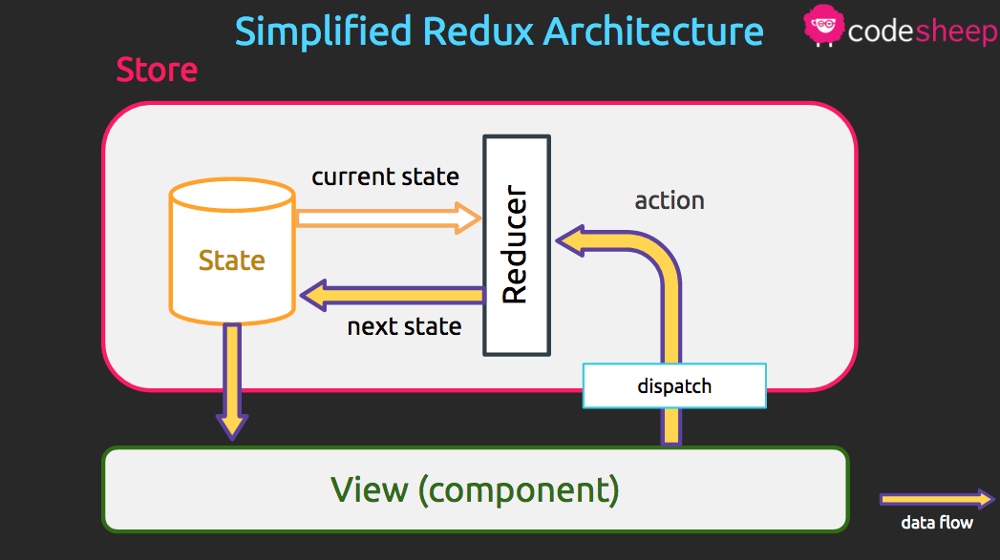
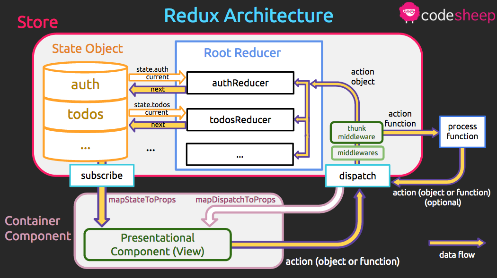

คิดว่าหลายๆคนที่เคยเขียน Redux กันมาบ้าง คงจะคุ้นเคยกับคำว่า Uni-Directional Data Flow ซึ่งได้อิทธิพลมาจาก Flux Architecture แต่ว่าพอไปเริ่มเขียนกันจริงแล้ว ช่วงแรกๆจะเห็นภาพไม่ค่อยชัดว่ามันสัมพันธ์กับแต่ละ component ที่เราเขียนยังไง ในบทความนี้ผมเลยนำแผนผัง Redux Architecture ที่ทำขึ้นมาเพื่อใช้สอนใน Bootcamp ของ CodeSheep มาให้ดูกันนะครับ

หมายเหตุ บทความนี้เหมาะสำหรับคนที่เคยเขียน redux มาก่อนแล้ว แต่ถ้าไม่เคยเขียนมาก่อนก็ไม่ต้องสนใจส่วนที่เป็นโค้ดก็ได้ครับ

Simplified Redux Architecture
=============================


เริ่มจากอันแรกเป็นแผนผังให้เห็นภาพรวมแบบง่ายๆ ที่หลายๆที่ก็ทำออกมาคล้ายๆแบบนี้กัน มีจุดที่น่าสนใจดังนี้ครับ

Store
-----
1. state และ reducer อยู่ใน store ซึ่งช่วยให้เราจำได้ว่าตอนเราสร้าง store ด้วยคำสั่ง `createStore` เราเลยต้องส่ง `initialState` กับ `rootReducer` เป็น parameters เพื่อสร้างก้อน store นี้ขึ้นมานั่นเอง
2. store จะมีคำสั่ง `dispatch` เป็น API ให้เรียกใช้ได้ ถ้าจำกันได้ตอนเราทำ `mapDispatchToProps` เราจะเรียกคำสั่ง `dispatch` ได้ ซึ่งคำสั่งนี้ก็คือตัวเดียวกับ `store.dispatch` นั่นเอง

Simplified Data Flow
--------------------
การวิ่งของข้อมูลที่เป็นทิศทางเดียว (Uni-directional Data Flow) จะแทนด้วยลูกศรสีเหลืองกรอบม่วง โดยภาพรวมแบบง่ายๆ เป็นดังนี้ครับ
1. เริ่มต้นจากกล่อง state วิ่งลงมายัง View หรือ Component ของเรา (เข้ามาเป็น props)
2. เมื่อ View ต้องการเปลี่ยนค่าใน store จะเรียก `dispatch` เพื่อส่ง action ไปยัง reducer
3. Reducer เป็นฟังก์ชันที่รับค่า state ปัจจุบัน และ action เข้ามา แล้วคืนค่าออกมาเป็น state ถัดไป
4. เมื่อ state เกิดการเปลี่ยนแปลงก็จะส่งค่ากลับลงมาเพื่ออัพเดท View ผ่านทาง props

สังเกตว่าในภาพ state เป็นกล่องเดียว แต่จริงๆทุกครั้งที่ state เปลี่ยนจะเกิดกล่องใหม่ของส่วนที่เปลี่ยนแปลงขึ้นมา โดยเราจะไม่ไปแก้ไขค่าในกล่อง state เดิม (ตามหลักการของ pure function ที่จะไม่ก่อให้เกิด side effect)

พอเห็นภาพรวมง่ายๆแบบนี้แล้ว เดี๋ยวเราลองไปดูแบบเต็มๆกันครับ

(Almost Complete) Redux Architecture
====================================


จะเห็นว่าพอเรามาเขียนโค้ดจริงๆมันมีหลายละเอียดปลีกย่อยเพิ่มมามาก ที่ใส่คำว่า **almost complete** คือจริงๆมันยังมีรายละเอียดมากกว่านี้ที่เรามองไม่เห็นและไม่ได้ใช้โดยตรง แผนภาพนี้เลยเน้นเฉพาะที่เกี่ยวข้องตอนเราใช้กันจริงๆครับ

Store
-----
1. State object ของเรามีลักษณะเป็น key-value ทั่วไป แต่ละ key (เช่น auth, todos ในภาพ) ก็จะมี reducer ที่รับผิดชอบอยู่
2. Root Reducer คือที่เราสร้างจากฟังก์ชัน `combineReducers` นั่นเอง ก็จะประกอบด้วย reducer แต่ละตัวที่รับผิดชอบแต่ละ sub-state ตาม key ของ state object
```js
const rootReducer = combineReducers({
  auth: authReducer,
  todos: todoReducer,
})
```

3. Middlewares ก็จะมีหลายตัว โดยภาพในตัวอย่างเราอาจมี middleware ตัวอื่นๆ ก่อนที่จะไปถึง redux-thunk middleware เป็นต้น
4. จากข้อ 1 - 3 จะเห็นภาพชัดขึ้นว่าฟังก์ชัน `createStore` ที่ได้พูดไปแล้วมันต้องประกอบด้วยอะไรบ้างถึงได้เป็น store ขึ้นมา ก็คือ `initialState`, `rootReducer`, และ `applyMiddleware` ที่เราใช้กันนั่นเอง
```js
const store = createStore(
  initialState,
  rootReducer,
  applyMiddleware(
    thunk,
    otherMiddleware,
  )
)
```
5. นอกจากฟังก์ชัน `dispatch` แล้ว store ยังมี API อื่นๆอีก ตัวที่ใช้กันโดยไม่รู้ตัวก็คือ `store.subscribe` ที่จะคอยเรียก callback ให้ถ้า state มีการเปลี่ยนแปลง ซึ่งตัวที่แอบทำการ subscribe ให้เราก็คือฟังก์ชัน `connect` นั่นเอง โดยมันจะไป subscribe store ที่อยู่ใน context (อันนี้ขอไม่ลงรายละเอียดเรื่อง context ให้นึกว่ามันคล้ายๆ global object ที่ทำให้ส่งค่าต่างๆไปยังทุก component ได้โดยไม่ต้องส่งผ่าน props) ที่ component ชื่อ `Provider` เป็นคนจัดเตรียมไว้ให้ นั่นเป็นเหตุผลว่าทำไมเราต้องมี `Provider` ครอบโค้ดของเราและรับ store เป็น props เข้าไป

```js
<Provider store={store}>
  ...
</Provider>
```

Data Flow
---------
ลองมาดูการวิ่งของข้อมูลแบบเต็มๆ กัน ขอแปะภาพเดิมซ้ำอีกที่จะได้ไม่ต้องเลื่อนขึ้นไปดูนะครับ


1. เริ่มต้นจากกล่อง state โดยตอนเริ่มต้น container component ที่ครอบ presentational component ของเรา (ที่สร้างจากฟังก์ชัน `connect`) จะดึงค่า state และคำสั่ง dispatch จาก store มาให้ แล้วโยนต่อไปให้ `mapStateToProps` และ `mapDispatchToProps` เพื่อส่งเข้าไปเป็น props ให้เรา
```js
const mapStateToProps = state => ({
  auth: state.auth,
  todos: state.todos,
})
const mapDispatchToProps = dispatch => ({
  fetchTodos: () => dispatch(fetchTodos())
})
export default connect(mapStateToProps, mapDispatchToProps)(TodoList)
```

2. Presentational Component ทำการเรียกฟังก์ชันที่จะทำการ dispatch โดยอาจจะ dispatch เป็น action object หรือเป็น action function (ถ้ามีการใช้ redux-thunk middleware)
3. ระหว่างการ dispatch กับ reducer จะมี middleware ทั้งหลายคั่นอยู่ โดยถ้ามีการใช้ redux-thunk ก็จะมีการตรวจสอบว่า action ที่รับเข้ามานั้นเป็น object หรือเป็น function
  * ถ้าเป็น function จะทำการประมวลผล function นั้นก่อน ซึ่งในฟังก์ชันนั้นอาจจะมีการ dispatch อย่างอื่นออกมาอีกก็ได้
  ```js
  const fetchTodo = () => dispatch => {
    fetch(...)
      .then(todos => dispatch(fetchTodosSuccess(todos)))
  }
  ```
  * ถ้าเป็น object ก็จะส่งไปเข้า root reducer ทันที
  ``` js
  const fetchTodosSuccess = (todos) => ({
    type: FETCH_TODOS_SUCCESS,
    payload: todos,
  })
  ```
4. ที่ rootReducer เป็นจุดที่คนเข้าใจผิดกันมากว่า action แต่ละประเภทจะไปเข้าแต่ละ reducer ที่เกี่ยวข้อง แต่จริงๆแล้ว **ทุก** action จะไปเข้า **ทุก** reducer ทั้งหมด แล้วแต่ละ reducer ถึงไปเลือกเองว่าถ้าไม่ต้องการก็ return state เดิมที่เป็นอยู่ไม่ต้องทำอะไร (ที่เรามักจะปล่อยผ่านด้วย `default` ใน `switch case` นั่นเอง)
5. แต่ละ reducer ก็จะได้รับ parameter เป็น action object และ sub-state เฉพาะ key ที่มันรับผิดชอบมาเท่านั้น
```js
const todoReducer = (state, action) => { // state ตรงนี้เป็นเพียง state.todos ของ root state tree
  ...
}
```
และก็จะ return ค่าเป็น state ถัดไปออกมา
6. เมื่อ state เปลี่ยน ก็จะ trigger container component ที่ subscribe store อยู่เพื่อไปอัพเดท props ของ presentation component นั่นเอง

ก็จะจบรอบการทำงาน 1 รอบของ ​Redux

ทิ้งท้าย
----
ก็หวังว่าแผนภาพ Redux Architecture นี้จะช่วยให้เห็นภาพรวมการเชื่อมโยงของแต่ละส่วนใน Redux มากขึ้นนะครับ ช่วงแรกๆ ที่ฝึก Redux จะรู้สึกว่ายาก เพราะว่า learning curve ค่อนข้างสูง แต่พอเข้าใจแล้วที่เหลือก็จะเป็น pattern เดิมๆ ซ้ำไปมาตลอดครับ อารมณ์เดียวกับ React เลย แนะนำว่าให้ลองเขียนแอพ TodoMVC ขึ้นมาเล่นโดยไม่ดูเฉลยซัก 3 รอบก็จะทำให้เข้าใจการทำงานของ redux แน่นขึ้นมากล่ะครับ
