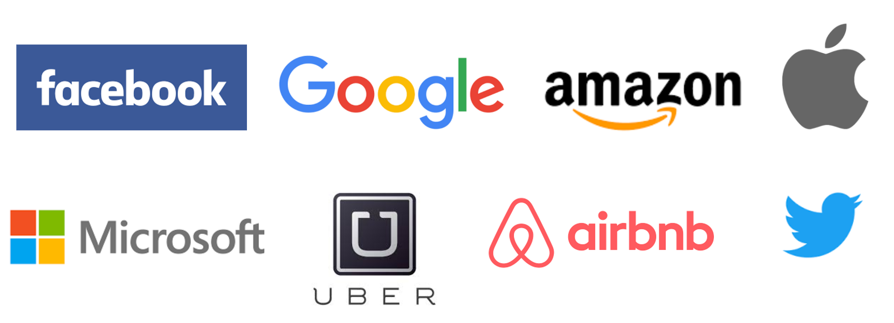

> **Disclaimer**
>
> เนื้อหาในบทความนี้เป็นมุมมองของผู้เขียนเพียงอย่างเดียว ไม่มีส่วนเกี่ยวข้องกับนายจ้างปัจจุบันหรืออนาคต เนื้อหาทุกอย่างเป็นเพียงแนวทางทั่วไป ซึ่งอาจแตกต่างไปในแต่ละบริษัทหรือตำแหน่งงาน

คิดว่าหลายๆคนคงอยากรู้ว่าการจะเข้าไปทำงานในตำแหน่งวิศวกร (Engineer) กับบริษัทใหญ่ๆระดับโลก เช่น Facebook Google Amazone Microsoft Apple ฯลฯ นั้นต้องทำอย่างไรบ้าง ผมได้มีโอกาสสัมภาษณ์งาน และกำลังจะเข้าทำงานกับหนึ่งในบริษัทข้างต้น จึงอยากมาแชร์ประสบการณ์นี้กันครับ

สไลด์ประกอบบทความนี้ดูได้ที่ https://www.slideshare.net/supasate/how-to-get-hired-by-top-tech-companies

เป้าหมาย
=======
เนื่องจากว่าภรรยาของผมนั้นอยากไปลองใช้ชีวิตอยู่ที่อเมริกา เป้าหมายตั้งต้นของผมเลยก็คือสมัครงานกับบริษัทที่อเมริกา (ใครกำลังคิดว่ากลัวเมีย ขอให้เปลี่ยนไปใช้คำว่าเคารพเมียแทนนะครับ) ก็เลยมองหาว่าถ้าต้องไปแล้วก็อยากทำงานกับบริษัทที่มีอย่างน้อย 4 ใน 7 คุณสมบัติต่อไปนี้
* เป็นองค์กรที่มี Engineering Culture
* เป็นองค์กรที่มีสภาพแวดล้อมเหมาะแก่การพัฒนาตัวเอง เปิดโอกาสให้ลองสิ่งใหม่ๆที่สนใจ
* เป็นองค์กรที่เต็มไปด้วยคนที่เก่งกว่าเรา
* เป็นองค์กรที่ผมชอบใช้ผลิตภัณฑ์ของเค้า
* เป็นองค์กรที่เน้นด้านการศึกษา
* เป็นองค์กรที่สนับสนุนให้มีส่วนร่วมกับชุมชนโอเพ่นซอร์ส
* เป็นองค์กรระดับต้นๆของโลกหรือเป็นองค์กรที่มีการเติบโตสูง

ผลลัพธ์
=====
ผมเริ่มยื่นสมัครงานเดือนกุมภาพันธ์ 2559 แต่พบว่าหลายอย่างนั้นยากกว่าที่คิดโดยเฉพาะปัญหาเรื่อง Visa (จะกล่าวต่อไป) ซึ่งสุดท้ายแล้วผมยังไม่สามารถเข้าอเมริกาได้ แต่ก็ได้งานที่ Facebook สาขาสิงคโปร์แทน โดยกว่าจะได้งานใช้เวลาเกือบ 1 ปี (รู้ผลว่าผ่านคือ มกราคม 2560)

สิ่งที่ได้เรียนรู้ก่อนที่จะถูกเรียกสัมภาษณ์งาน
===============================
บทเรียนที่ 1 การเข้าไปทำงานที่อเมริกานั้นยากมาก
--------------------------------------
> ปีที่สมัคร 2559 ก่อนดอนัลด์ ทรัมป์ขึ้นเป็นประธานาธิบดี

การที่คนต่างชาติจะเข้าไปทำงานที่อเมริกาได้นั้นต้องมี Visa ทำงาน ซึ่งขอพูดคร่าวๆแต่ไม่ลงรายละเอียดมากดังนี้
1. H-1B (Specialty Occupation) อันนี้เป็นท่ามาตรฐานสำหรับคนทำงานสายพัฒนาซอฟต์แวร์ โดยจะใช้ Visa นี้ได้นั้น ต้องสัมภาษณ์งานกับบริษัทให้เค้ารับเราเสียก่อน หลังจากนั้นบริษัทจะไปยื่นขอ Visa ให้เรา ซึ่ง Visa ก็จะมีจำกัดมาก (จะพูดถึงในหัวข้อหลัง) ทำให้ต้องไปจับฉลากว่าจะได้ Visa มั้ยอีกต่อ โอกาสได้อยู่ประมาณ 30%
2. L-1 (Intracompany Transfer) อันนี้ให้ทำงานกับบริษัทที่มีสาขาอยู่ต่างประเทศก่อนอย่างน้อย 1 ปี แล้วบริษัทยินยอมให้ย้ายไปสาขาที่อเมริกา
3. E-1/E-2 (Treaty Trader/Treaty Investor) อันนี้สำหรับคนเอาเงินไปลงทุนหรือเปิดบริษัทที่อเมริกา เพื่อให้เกิดการจ้างแรงงานคนอเมริกา ใช้เงินอย่างน้อยประมาณ 2-3 ล้านบาทขึ้นไป
4. F-1 (Student) อันนี้ถ้าไปเรียนต่อที่อเมริกาในสาขาที่เกี่ยวข้อง เรียนจบจะได้ Visa ทำงานได้เลยทันที แล้วค่อยให้บริษัทไปยื่น sponsor H-1B ต่อในปีถัดๆไป

ซึ่งถ้าจะไปทำงานที่อเมริกาไม่ว่าจะ Visa ไหนก็จะมี trade-off เรื่อง ความสามารถ ดวง เวลา เงิน

กรณีของผมคืออยากได้ H-1B หรือ L-1

บทเรียนที่ 2 การสมัครผ่านหน้าเว็บของบริษัทแทบจะไม่มีประโยชน์
------------------------------------------------
แต่ละบริษัทก็จะมีหน้า careers หรือ jobs ที่เราสมัครเข้าไปได้ แต่ว่าบริษัทระดับโลกคนสมัครกันเป็นล้านคน โอกาสที่เราจะได้รับเลือกนั้นมีน้อยมาก โดยจะมี 2 กรณีใหญ่ๆถ้าสมัครผ่านหน้าเว็บคือ

1. หลุมดำ (Black hole)
เคสนี้คือยื่นสมัครไป แล้วจะได้เมลตอบรับอัตโนมัติว่าเราสมัครแล้ว แต่ไม่มีการติดต่อกลับมาอีกเลย เหมือนกับหายไปในหลุมดำ

2. ปฏิเสธการเรียกสัมภาษณ์
เคสนี้คือมีการติดต่อกลับมาแต่จะบอกว่าคุณสมบัติเรายังไม่ตรงกับตำแหน่งที่เค้าต้องการ (ทั้งๆที่ผมก็สมัครตำแหน่ง Software Engineer ปกติ) เลยขอโทษที่ไม่สามารถเรียกเราสัมภาษณ์ได้ ซึ่งจริงๆแล้วผมได้ลองสอบถามเพื่อนๆที่สามารถไปสอบถามฝ่าย HR ของบางบริษัทได้ ก็ได้ใจความทำนองเดียวกันว่าถ้ายังไม่มี Visa ทำงาน บริษัทก็ยังไม่ค่อยอยากเสียเวลารับคนนอกประเทศ เพราะต้องไปวัดดวงจับฉลาก Visa อีก (เว้นแต่ว่าคนนั้นจะ profile เทพและเค้าต้องการตัวจริงๆ เช่น เป็นผู้สร้างเฟรมเวิร์คดังๆ)

บางบริษัทก็มีแคมเปญการรับสมัครงานที่สร้างสรรค์ เช่น Uber จะมี Code On The Road: Hacker Challenge ซึ่งปีก่อนผมไปอเมริกา แล้วเรียก Uber ระหว่างที่นั่งอยู่บนรถ บนมือถือก็มีเด้งขึ้นมาว่าสนใจทำ Hacker Challenge มั้ย ก็เลยทดลองทำดู มีโจทย์แนวอัลกอริทึม 3 ข้อเป็น multiple choice เช่น ให้หา Big O, ให้หาจุดผิดในโค้ด, ให้หาว่าควรใช้ data structure แบบไหน เป็นต้น ซึ่งผมทำผ่านเค้าก็จะถามว่าสนใจร่วมงานกับ Uber มั้ย ผมก็ตอบสนใจและส่งรายละเอียดตำแหน่งที่สนใจไป แต่สุดท้ายแล้วก็หลุมดำ ไม่มีติดต่อกลับมาเลย (แม้ว่าจะส่งเมลไปสอบถามซ้ำก็ตาม)

ผมสมัครไปเยอะพอสมควร แต่ก็เป็นหลุมดำ หรือถูกปฏิเสธการเรียกสัมภาษณ์ทุกที่ที่สมัครผ่านหน้าเว็บไซต์ไป

**ประเภทหลุมดำ**
* Staff Engineer - Distributed systems software @ VMWare
* Software Engineer @ Autodesk
* Senior Software Developer @ IBM - StrongLoop
* Software Engineer, Palo Alto @ HackerRank
* Software Engineer - Evolved Network OS @ Cisco
* 2 Software Engineer positions @ Uber
* Software Engineer @ Arista
* Software Engineer, Product @ Twitter

**ประเภทถูกปฏิเสธเรียกสัมภาษณ์**
* Software Engineer, Front End @ Google, New York
* Software Engineer @ Google, New York
* Software Engineer, Tools & Infrastructure @ Google, Zurich
* Software Engineer @ Google, Japan
* Strategic Customer Engineer, Google Cloud Platform @ Google, Singapore
* 3 Software Engineer positions @ Coursera
* 3 Engineering positions @ Slack
* Full Stack Engineer @ Udacity
* Full Stack Software Engineer - iTunes U @ Apple
* Software Engineer @ Quora
* Software Developer @ Khan Academy

แต่ก็เคยอ่านเจอว่ามีคนสมัครผ่านหน้าเว็บแล้วได้เหมือนกัน แต่โอกาสน้อยมาก และบางคนสมัครเป็นร้อยบริษัททีเดียว

บทเรียนที่ 3 การไปเรียนต่ออาจเป็นทางที่ง่ายที่สุด
-------------------------------------
เพื่อนผมที่อเมริกาแนะนำเลยว่าให้เรียนต่อก่อนดีกว่าถ้าอยากทำงานที่อเมริกา เพราะจะได้ Visa F-1 และได้สิทธิทำงานทันทีหลังเรียนจบ ซึ่งตอนแรกผมก็จะยังคิดว่าสมัครงานไปเลยคงไม่ยากขนาดนั้น แต่หลังจากสมัครมาเกือบ 1 ปีถึงได้เข้าใจเลยว่าการไปเรียนต่อน่าจะเป็นทางที่ง่ายสุดแล้วจริงๆ เพราะถ้าเมื่อใดเรามี Visa ที่ทำงานที่อเมริกาได้ บริษัทจะเรียกคุณสัมภาษณ์ง่ายขึ้นมากทันที

บทเรียนที่ 4 การให้คนในองค์กรแนะนำให้ (refer) จะทำให้ resume ขึ้นมาให้อยู่บนสุดของกองใบสมัคร
------------------------------------------------------------------------------
ในแต่ละบริษัทส่วนใหญ่พนักงานจะได้โบนัสถ้าสามารถช่วยหาคนมาทำงานและผ่านโปรได้ ซึ่งถ้าเรารู้จักใครเราอาจขอให้เค้าช่วย refer ให้เราได้ถ้าเค้าเชื่อว่าเราน่าจะมีโอกาสผ่านการสัมภาษณ์

ผมก็เช่นกันได้ใช้วิธีให้เพื่อนในแต่ละบริษัทที่รู้จักช่วย refer ให้ และทำให้ได้รับเมลติดต่อกลับมาทันที

ดังนั้นการทำความรู้จักกับคนเยอะๆนั้นสำคัญมาก

บทเรียนที่ 5 การให้คนในองค์กรแนะนำให้ (refer) ไม่ได้หมายความว่าจะได้โอกาสในการสัมภาษณ์
-------------------------------------------------------------------------
ความยากยังไม่จบครับ ถึงแม้จะมีคน refer เราให้แล้ว แต่สุดท้ายผมก็โดนหลายที่ตอบว่าทักษะเราไม่ตรงตำแหน่งงานอยู่ดี แต่ก็ยังยืนยันครับว่าการให้คน refer ยังเป็นวิธีที่ดีที่สุดอยู่ดี

บทเรียนที่ 6 วิธีการอื่นๆเพื่อให้ได้โอกาส (แต่ก็ไม่ง่าย)
-----------------------------------------
Google Code Jam และ Facebook Hacker Cup เป็นอีกช่องทางนึง ถ้าเราทำคะแนนได้ดีทาง Google หรือ Facebook ก็จะติดต่อมา อันนี้ยืนยันเพราะเพื่อนผมที่เข้าถึงรอบ 3 ของ Google Code Jam ได้รับการติดต่อเพื่อสัมภาษณ์เลย

การไปเข้าร่วมโปรเจค Open Source ที่ดังๆก็มีส่วนช่วยเช่นกัน แต่ก็ควร contribute แบบมี impact หน่อยไม่ใช่แค่แก้สะกดผิดหรือบั๊กง่ายๆ เพราะเป็นส่วนหนึ่งให้บริษัทเห็นว่าเราสามารถทำงานกับ Codebase ขนาดใหญ่ได้ แต่ถึงแม้แก้เล็กๆน้อยๆก็อาจมีบริษัทอื่นติดต่อมาได้ (มีน้องที่รู้จักไปแก้เรื่องสะกดผิด แล้วมีบริษัทติดต่อมา คาดว่าเค้ากวาดจากคนที่มีรายชื่ออยู่ใน contributors แล้วติดต่อหมด)

การเข้าร่วมโครงการแข่งขันหรือ Hackathon ต่างๆ อันนี้ก็มักจะมีคนมาติดต่อให้ไปร่วมงานได้ถ้าเห็นฝีมือเราดี

การเข้าร่วม Networking event ต่างๆ ยิ่งรู้จักคนมาก ก็มีโอกาสที่เค้าจะช่วย refer ให้เราได้

บทเรียนที่ 7 ช่วงเวลาที่สมัครสำคัญมาก
-----------------------------
อันนี้จะเกี่ยวกับเรื่อง Visa H-1B ซึ่ง Visa นี้ปีนึงจะมีโควต้าแค่ 85,000 คนเท่านั้น โดย 20,000 คนแรกจะจับฉลากจากคนที่เรียนจบในอเมริการะดับปริญญาโทขึ้นไป แล้วคนที่พลาดจะยังได้เข้าไปจับฉลากกับโถรวมทั้งหมดอีก 60,000 คน (ส่วนถ้าเราไม่ได้เรียนที่นั่น ก็ถูกเข้าจับในโถ 60,000 คนครั้งเดียว)

โดยทางรัฐบาลสหรัฐจะเริ่มรับคำร้องขอ Visa วันที่ 1 เม.ย. ของทุกปี และส่วนใหญ่ก็จะเกินโควต้าจนต้องปิดรับภายในเวลาสัปดาห์เดียว แล้วนำไปจับฉลาก

ดังนั้นบริษัทที่จะ sponsor Visa ให้เรานั้นต้องเตรียมเอกสารทั้งหมดให้เสร็จภายในช่วงเดือน มี.ค. ซึ่งบริษัทต้องตกลงรับเข้าทำงานเสร็จแล้ว

และบริษัทใหญ่ๆใช้เวลาในการสัมภาษณ์ 1 - 2 เดือน (จะกล่าวต่อไปภายหลัง) ดังนั้นช่วงเวลาที่เริ่มสมัครที่ดีที่สุดคือช่วงเดือน ตุลาคม ถึง มกราคม

การเตรียมตัวสัมภาษณ์งาน
===================
เคสของผมมีโอกาสได้สัมภาษณ์ครั้งแรกกับ Google ในเดือน ก.พ. 59 ผ่านสัมภาษณ์รอบแรก แต่ตกสัมภาษณ์รอบที่ 2 และกว่าจะไปได้โอกาสสัมภาษณ์อีกครั้งกับ Facebook คือเดือน พ.ย. 59 เลย ซึ่งรูปแบบมีความคล้ายกัน และแตกต่างจากการสัมภาษณ์งานในเมืองไทยค่อนข้างมากทั้งรูปแบบและความยาก โดยเค้าจะเน้นเรื่องอัลกอริทึมและโครงสร้างข้อมูลเป็นอย่างมาก ถ้าทำส่วนนี้ไม่ได้ก็ไม่ต้องไปสัมภาษณ์ส่วนอื่นต่อ (ในขณะที่เมืองไทยบางที่อาจไม่สัมภาษณ์อัลกอริทึมเลย เพราะไม่ค่อยมีใครผ่าน ก็เลยเกิดลูปว่าโปรแกรมเมอร์ไทยก็เลยไม่สนใจอัลกอริทึมไปด้วย พอต้องไปสัมภาษณ์ต่างประเทศก็จะลำบาก)

โดยทั่วไปบริษัทระดับท้อป จะมีรูปแบบที่คล้ายๆกัน
1. รอบแรก สัมภาษณ์กับ Recruiter จะมีการพูดคุยเกี่ยวกับ background ความถนัด และจะมีการทดสอบแตกต่างกันไป บางที่อาจเป็นคำถามแนวความรู้ด้านอัลกอ โครงสร้างข้อมูล ภาษาโปรแกรมที่ใช้ บางที่ก็อาจให้เขียนโปรแกรมออนไลน์แก้โจทย์อัลกอเลย
2. รอบสอง เขียนโปรแกรมออนไลน์กับ Engineer จะให้เรา video call แล้วแชร์หน้าจอเพื่อเขียนโปรแกรมแก้ปัญหาด้านอัลกอริทึม โดยถ้าเป็น Google จะให้เขียนบน Google Docs ไม่มี syntax highlight ใดๆทั้งสิ้น ส่วนถ้าเป็น Facebook จะใช้ collabedit.com ก็จะมี highlight ให้อ่านง่ายขึ้นหน่อย (แต่ต้องเช็ค syntax error ด้วยตาตัวเองอยู่ดี) ซึ่งรอบนี้ถ้าเราทำได้ฉลุยก็จะได้ไปสัมภาษณ์ที่สำนักงานเลย แต่ถ้าคนสัมภาษณ์ยังไม่แน่ใจอาจมีรอบนี้ซ้ำอีกหนึ่งครั้ง
3. รอบสามถึงหก (แล้วแต่บริษัท) จะเป็น on-site คือทางบริษัทจะออกตั๋วเครื่องบินพร้อมที่พักให้เราบินไปสัมภาษณ์ที่สำนักงานเลย และสัมภาษณ์ทุกรอบจบในวันเดียวตั้งแต่เช้าถึงเกือบเย็น โดยแต่ละรอบจะให้แก้โจทย์อัลกอริทึมโดยเขียนบนกระดาน และบางรอบจะเป็นการออกแบบระบบ (เช่น ให้ออกแบบ Gmail ให้ออกแบบ Twitter เป็นต้น) โดยเน้นเรื่อง Scalability

ส่วนของผลเนื่องจากเป็นตำแหน่ง Solutions Engineer ที่นอกจากต้องเขียนโค้ดแล้ว ยังต้องไปคุยกับลูกค้าด้วย เลยจะมีสัมภาษณ์ด้านการสื่อสาร ด้านธุรกิจ ด้านการตัดสินใจเชิงกลยุทธ์ และมีให้เขียนแอพพลิเคชั่นขึ้นมาเพื่อนำไปนำเสนอให้คนสัมภาษณ์ฟังด้วย (และก็จะมีให้เขียนเพิ่มฟีเจอร์สดๆระหว่างสัมภาษณ์)

ทักษะที่ต้องใช้
==========
1. ภาษาอังกฤษ - สำคัญมาก เพราะถ้าฟังหรือพูดกับ recruiter ไม่ได้ก็ไม่ต้องไปทำอย่างอื่นต่อ นอกจากนั้นไมโครโฟนของคนสัมภาษณ์เสียงมักจะก้องหรือขาดหายเป็นบางคำเลยต้องมีทักษะด้านการฟังอย่างมาก

2. โครงสร้างข้อมูลและอัลกอริทึมพื้นฐาน - เหมือนสมัยเรียน ป.ตรี ไม่ได้เน้นการพิสูจน์ แต่เน้นการทำไปใช้ โดยต้องรู้ประสิทธิภาพการทำงานและความเหมาะสมในการใช้ในแต่ละสถานการณ์ หัวข้อที่ควรรูปได้แก่ (มี *** คือเจอบ่อย)
* Time/Space Complexity (Big-O)***
* Bit Manipulation
* Recursion***
* String***
* Array***
* Linked List (Singly, Doubly, Circular)***
* Hash Map***
* Stack***, Queue***, Priority Queue, Heap
* Tree, Binary Tree, Binary Search Tree, Tries, AVL/Red-Black Tree
* Tree Traversal (Pre-order, in-order, post-order), DFS***, BFS***
* Graph	Shortest-path
* Connected Component, Union-Find
* Sorting, Insertion Sort, Merge Sort, Quick Sort
* Searching, Binary Search***, Quick Select
* Dynamic Programming***, Memoization***

3. การติดต่อสื่อสาร - อันนี้ก็สำคัญมาก เพราะในทุกครั้งที่เราแก้โจทย์อยู่ เค้าจะต้องการให้เราพูดออกมาด้วยว่า เรากำลังคิดอะไรอยู่ เพราะเค้าอยากรู้กระบวนการคิดของเรา ดังนั้นต้องฝึกสื่อสารให้ชัดว่าเรากำลังจะทำอะไรให้เค้าเข้าใจให้ได้ ไม่ใช่เราเข้าใจคนเดียว

ผมเตรียมตัวอย่างไรบ้าง
==================
หนังสือ
-----
ผมใช้หนังสืออัลกอ 3 เล่ม คือ
1. Introduction to Algorithms (ของ CLRS) เล่มนี้ละเอียดยิบ
2. The Algorithm Design Manual (ของ S. Skiena) เล่มนี้อ่านสนุก มีตัวอย่างเคสการนำอัลกอไปใช้ในโลกจริง และมีตัวอย่างโค้ดสวยๆ
3. อัลกอริทึม การออกแบบและวิเคราะห์ (ของ รศ.ดร. สมชาย ประสิทธิ์จูตระกูล) หนังสือภาษาไทยที่ผมคิดว่าดีที่สุดมีตัวอย่างอัลกอรึทึมบางอย่างที่ 2 เล่มบนไม่มี

และใช้หนังสือในการฝึกโจทย์อีก 1 เล่ม คือ Cracking the Coding Interview (ของ G. McDowell) เล่มนี้ถือเป็นไบเบิ้ลสำครับคนสัมภาษณ์งานเลย มีสรุปเนื้อหาแบบกระชับ และโจทย์หลากหลายแบบให้เราค่อยๆฝึกคิดทีละขั้นตอน (มีอีกเล่มที่รุ่นน้องที่เข้า Google ได้ใช้คือ Programming Interviews Exposed ซึ่งดีเหมือนกัน)

การฝึกฝน
-------
1. leetcode.com เป็นเว็บรวบรวมโจทย์ที่คนเคยเจอมา มี online compiler ให้เรารันโค้ดเราเพื่อทดสอบผลได้ และมี discussion ให้เราได้เห็นวิธีที่ดี วิธีที่เขียนสวยๆ ตอนครั้งแรกที่ตก Google ยังฝึกไปได้ไม่เยอะ แต่หลังจากนั้นตลอดปีก็ฝึกไปเยอะมาก
2. HackerRank.com ถ้าใครไม่เคยทำโจทย์แนวนี้เลย เว็บนี้ก็จะเริ่มจากโจทย์แบบง่ายมากๆให้เราคุ้นเคยกัน จนไปถึงโจทย์ระดับสัมภาษณ์งานจริง
3. ฝึกเขียนกับกระดานจริง เนื่องจากว่าถ้าเราผ่านถึงรอบ on-site แล้วต้องไปเขียนกับกระดาน บางครั้งเราจะไม่ถนัด เพราะถนัดแต่จิ้มคีย์บอร์ด ดังนั้นจึงควรฝึกฝนเอาไว้ อันนี้ผมฝึกตั้งแต่เดือน ก.พ. เอาโจทย์มาทำทุกเช้าวันละข้อก่อนไปทำงาน ทำจนถึงประมาณเดือน เม.ย.
4. Sport programming พวก Google Code Jam, Facebook Hacker Cup, Codeforces, Top Coder พวกนี้โจทย์จะยากกว่าการสัมภาษณ์งานจริง แต่ก็ได้ฝึกสมองซีกเดียวกัน
5. Mock inteview อันนี้สำคัญมากๆ คือการซ้อมเสมือนสัมภาษณ์จริง ผมจับคู่กับรุ่นน้องคนนึงซ้อมเขียนบน Google Docs สัปดาห์ละ 1 ครั้งผลัดบทบาทกัน และช่วยกันให้ comment อีกฝั่งว่าควรปรับปรุงการคิดหรือการอธิบายยังไง ตลอดปีผมซ้อมไปทั้งหมด 36 ครั้ง
6. pramp.com เว็บนี้ดีมากสำหรับการ mock interview เพราะว่าบางครั้งเราซ้อมกับคนรู้จักบ่อยๆ เราจะเริ่มไม่ตื่นเต้นแล้ว เลยต้องให้ได้บรรยากาศการสัมภาษณ์กับคนแปลกหน้าบ้าง เว็บนี้จะช่วยนัดเวลาจับคู่ซ้อมกับเรา โดยจะมี feedback ตอนจบจากฝั่งตรงข้ามว่า ทักษะเราเป็นอย่างไร การสื่อสารเป็นอย่างไร น่าทำงานด้วยมั้ย

ทิ้งท้าย
=====
1. ตั้งเป้าหมายให้สูงเสมอ - การที่เราตั้งเป้าไว้สูงมันจะผลักดันตัวเองให้เกินขีดจำกัดเดิมที่เราเคยทำได้ ถึงสุดท้ายแล้วอาจจะยังไม่ถึงเป้าหมาย แต่สิ่งที่ได้ระหว่างทางนั้นคุณจะไม่เชื่อเลยว่าตัวเองสามารถทำอะไรแบบนี้ได้
2. ไม่มีใครแก่เกินเรียน - หลายคนคิดว่าอายุมากแล้วฝึกไม่ได้หรอก ผมตอนนี้อายุ 33 (ซึ่งน่าจะอายุมากกว่าน้องๆวัยหางานหลายๆคน) เริ่มเล่น Code Jam, Hacker Cup ปีละครั้งตอนอายุ 26 (เล่นเอาสนุกเฉยๆ จะได้ฝึกสมอง แต่ไม่ได้เข้ารอบลึกและไม่ได้ฝึกโจทย์อะไร) เพิ่งมาฝึกจริงจังตอนเริ่มสัมภาษณ์งานปีก่อน
3. มีความรักในสิ่งที่ทำ - อันนี้สำคัญมาก ถ้าแค่อยากเข้าบริษัทพวกนี้แต่ไม่ได้ชอบเขียนโปรแกรม ก็จะฝึกต่อเนื่องได้ไม่นานแล้วก็ล้มเลิกไป
4. ซ้อม ซ้อม และก็ซ้อม - การเข้าทำงานไม่จำเป็นต้องเป็นอัจฉริยะ ผมไม่ได้เทพสายอัลกอเลย แต่ผมซ้อมเยอะมาก
5. ห้ามยอมแพ้! - เอาจริงๆหลักจากตกสัมภาษณ์ Google แถมไม่มีบริษัทไหนเรียกสัมภาษณ์อีกเลยก็ท้อไปเหมือนกัน ซ้อมไปเรื่อยๆแบบไม่รู้เลยว่าจะได้สัมภาษณ์มั้ยเป็นเวลากว่า 8 เดือน แต่กัดฟันว่าซักวันเดี๋ยวมันต้องถึงเวลา และมันก็มาจริงๆ ถ้ายอมแพ้ไปก่อนก็ปล่อยโอกาสหลุดไปอีกครั้ง

ก็หวังว่าบทความนี้จะทำให้เห็นภาพรวมของการสมัครงานบริษัทระดับโลกว่าควรรู้และต้องเตรียมตัวอะไรบ้างนะครับ
